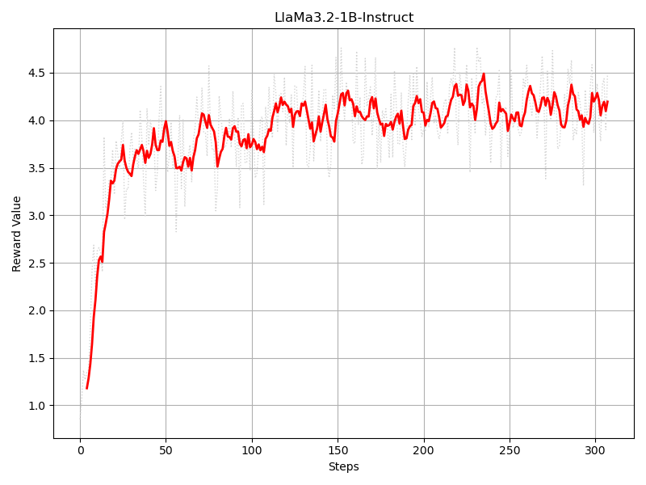

# Minimal-GRPO
Implementation of Group Relative Policy Optimization (GRPO) to fine-tune Open Language Models like LlaMa-3.2, Qwen2.5 for Math Tasks.


## Overview
This project implements a simple and customizable pipeline for fine-tuning language models using GRPO strategy introduced by [DeepSeekMath](https://arxiv.org/abs/2402.03300). This approach utilizes group-based relative advantage estimates to guide the optimization. The training data comprises synthetic math expressions and their solutions. The framework is flexible and can be extended to other tasks.

## Requirements
pytorch **·** transformers **·** peft **·** flash-attn **·** pyyaml **·** tensorboard

## Usage

1. Edit the `config.yml` file with the required hyperparameters and Language model path.
2. Then, run the following command to fine_tune the model:
```bash
python3 grpo_train.py
```
If needed, replace the existing dataset with your custom data.

## Results
The table below demonstrates the improvement in model responses before and after GRPO fine-tuning:

**Model: LlaMa-3.2-1B-Instruct**
| | |
|---|---|
|  **Prompt:**  | **Expand 3\*(x+1)\*(x+2)** |
|  **Responses:** | |
| <div align="center">**Before Fine-tuning**</div> | <div align="center">**After GRPO Fine-tuning**</div> |
| **\<think>**<br>1. Multiply the first two terms: 3*(x+1) = 3x + 3<br>2. Multiply the result by the third term: (3x + 3)*(x+2)<br>**\</think>**<br>**\<answer>** 3x^2 + 3x + 6x + 6 **\</answer>** | **\<think>**<br>1. To expand the expression 3*(x+1)*(x+2), we need to apply the distributive property to expand the expression.<br>2. The distributive property states that a(b+c) = ab + ac.<br>3. So, we can expand the expression as 3*(x+1)*(x+2) = 3*(x*x + x*2 + 1*x + 1*2).<br>4. Now, we can simplify the expression by multiplying the terms.<br>5. 3*(x*x + x*2 + 1*x + 1*2) = 3*x^2 + 6*x + 3*x + 2.<br>6. Combine like terms.<br>7. 3*x^2 + 6*x + 3*x + 2 = 3*x^2 + 9*x + 2.<br>8. The final expanded expression is 3*x^2 + 9*x + 2.<br>**\</think>**<br>**\<answer>** 3*x^2 + 9*x + 2 **\</answer>** |
|  **Prompt:**  | **Solve 78-(3\*(47-2)+2)** |
|  **Responses:** | |
| <div align="center">**Before Fine-tuning**</div> | <div align="center">**After GRPO Fine-tuning**</div> |
| **\<think>**<br>1. First, we need to evaluate the expression inside the parentheses: 47-2<br>2. 47 - 2 = 45<br>3. Now, we multiply 3 by the result: 3 * 45 = 135<br>4. Finally, we subtract 135 from 78: 78 - 135 = -57<br>**\</think>**<br> **\<answer>** The final answer is -57 **\</answer>** | **\<think>**<br>1. Start by evaluating the expression inside the parentheses: 47-2 = 45<br>2. Now, multiply 3 by the result: 3 * 45 = 135<br>3. Add 2 to the result: 135 + 2 = 137<br>4. Finally, subtract 137 from 78: 78 - 137 = -59<br>**\</think>**<br> **\<answer>** -59 **\</answer>** |
<!-- ------------------------------------
------------------------------------
**Model: Qwen2.5-0.5B-Instruct**
| Before Fine-tuning | After GRPO Fine-tuning |
|---|---|
|  **Prompt:**  | **Expand 3\*(x+1)\*(x+2)** |
| **\<think>**<br>1. Multiply the first two terms: 3*(x+1) = 3x + 3<br>2. Multiply the result by the third term: (3x + 3)*(x+2)<br>**\</think>**<br>**\<answer>** 3x^2 + 3x + 6x + 6 **\</answer>** | **\<think>**<br>1: First, I'll distribute 3 to (x+1)*(x+2)<br>2: This gives 3(x^2 + 2x + x + 2)<br>3: Simplifying the inner expression: 3(x^2 + 3x + 2)<br>4: Distributing the 3: 3x^2 + 9x + 6<br>**\</think>**<br> **\<answer>** 3x^2 + 9x + 6 **\</answer>** |
|  **Prompt:**  | **Solve 78-(3*(47-2)+2)** |
| **\<think>**<br>1. First, we need to evaluate the expression inside the parentheses: 47-2<br>2. 47 - 2 = 45<br>3. Now, we multiply 3 by the result: 3 * 45 = 135<br>4. Finally, we subtract 135 from 78: 78 - 135 = -57<br>**\</think>**<br> **\<answer>** -57 **\</answer>** | **\<think>**<br>1: First, I'll calculate 47-2 = 45<br>2: Then, 3*45 = 135<br>3: Next, 135+2 = 137<br>4: Finally, 78-137 = -59<br>**\</think>**<br> **\<answer>** -59 **\</answer>** | -->

## Rewards accumulated per step during training

<div align="center">
  <div style="display: flex; justify-content: center;">
    
    
  </div>
</div>

## Contributing
Open an issue or submit a pull request if you have any suggestions or improvements.

## Acknowledgments
- This project utilizes models and tools made available by [Hugging Face](https://huggingface.co/).

<!-- 

---------------------------------------
Expand 3*(x+1)*(x+2)
<think>
1. First, we need to multiply the two binomials (x+1) and (x+2).
2. To do this, we multiply each term in the first binomial by each term in the second binomial.
3. This gives us: x*x + x*2 + 1*x + 1*2
4. Simplifying this, we get: x^2 + 2x + x + 2
5. Combining like terms, we get: x^2 + 3x + 2
</think>
<answer>x^2 + 3x + 2</answer>
---------------------------------------
---------------------------------------
Solve 78-(3*(47-2)+2)
<think>
1. First, we need to evaluate the expression inside the parentheses: 47-2
2. 47 - 2 = 45
3. Now, we can substitute the result back into the original expression: 78 - (3 * 45)
4. Next, we need to multiply 3 and 45: 3 * 45 = 135
5. Now, we can substitute the result back into the expression: 78 - 135
6. Finally, we need to subtract 135 from 78: 78 - 135 = -57
</answer> -->
